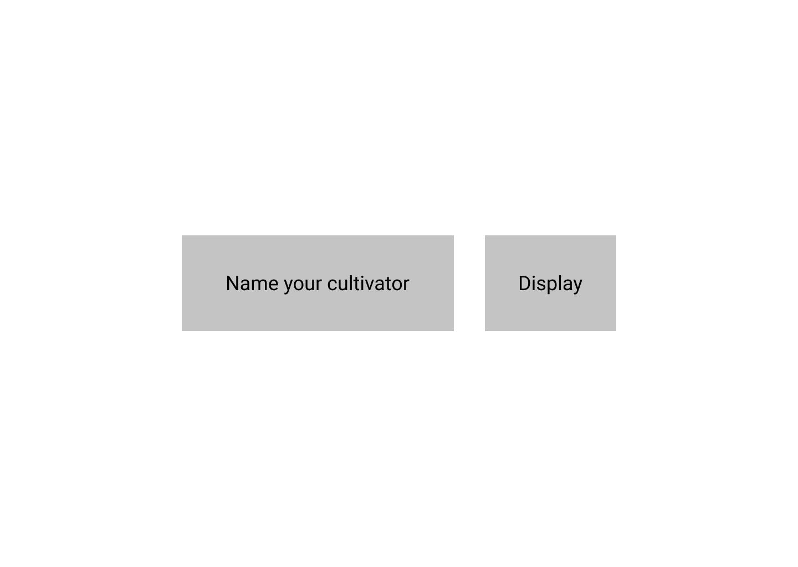
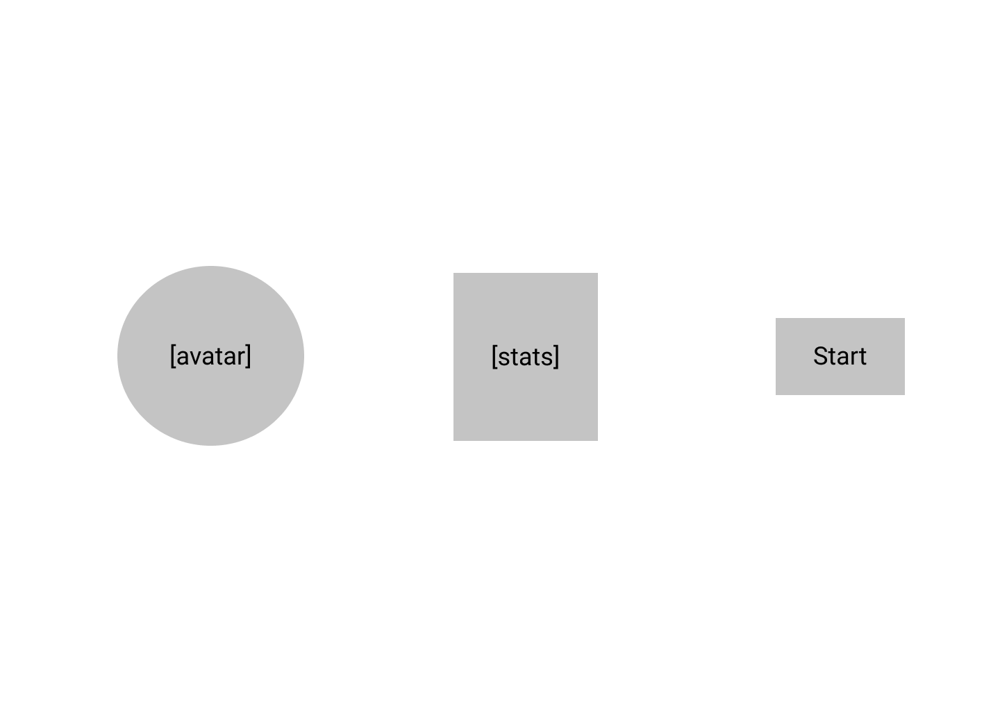
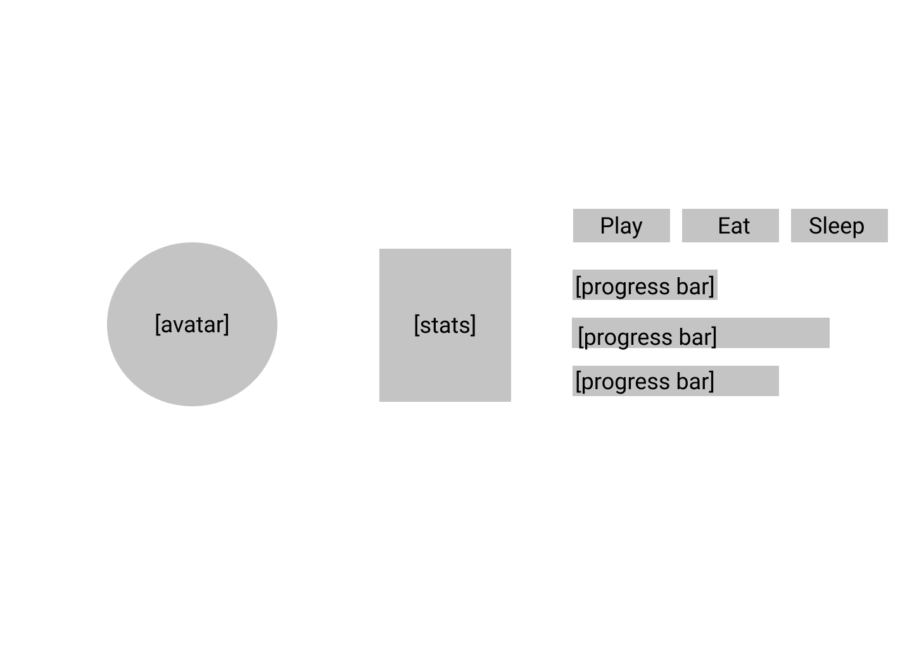

# Train Your Cultivator
## Develop your Golden Core, Keep your Cultivator Healthy

Modeled after 魔道祖师(Módào Zǔshī) by 墨香铜臭(Mòxiāng Tóngxiù), this game will simulate training your young Cultivator - keep your Cultivator entertained, fed, and rested so they can mature and increase their training level!

### User Stories
As A User:
- I want to navigate to the hosted url
- Landing page displays a text input box and a submit button which allows me to name my cultivator
- Start page displays the cultivator avatar, current stats, and a start button which will begin the timing functions (ie start the game)
- Game page displays the avatar, stats, and buttons to interact with the cultivator stats. 

### Wireframe
- Landing Page

- Start Page

- Game Page

